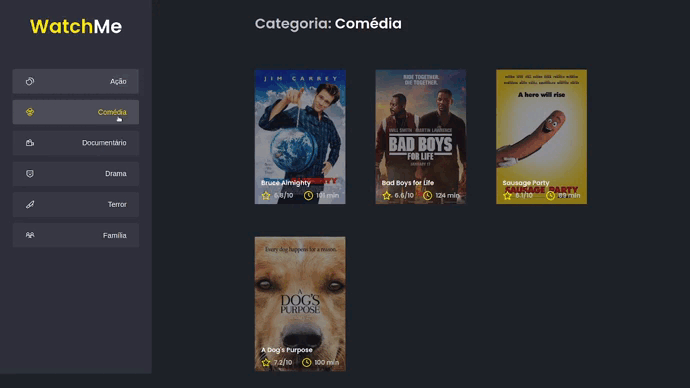

# WatchMe
## Componentizing the application
### Module 1 - Challenge 2 - RocketSeat - Ignite ReactJS 🔥
---
<p>
  <a href="https://rocketseat.com.br">
    
  </a>
  
  
  <a href="https://opensource.org/licenses/MIT">
    
  </a>
</p>

An application for listing movies by genre, developed during the first challenge of Ignite, Rocketseat's bootcamp, specifically, from the ReactJS Trail. The project was developed from a previously available template.

The main goal of the challenge was to refactor the `App` component, stripping all the logic and HTML inside it, splitting them into **three components**:

- `Sidebar`: In the sidebar it is possible to select which category of movies should be listed;
- `Header`: The application header has only the name of the selected category which must dynamically change.
- `Content`: The content contains the list of cards of the movies that are contained in the selected category.

## Application in Use



<br>

## Running The Project

```bash
# Open a terminal and copy this repository with the command
git clone https://github.com/jorgeeder/watchme-ignite-challenge-02

# or use the download option.

# Enter the folder with
cd watchme-ignite-challenge-02

# Install dependencies
yarn install
or
npm install

# Start Fake API
yarn server
or
npm server

# Run the application
yarn dev
or 
npm dev

# Access http://localhost:8080 in your browser
```

<br>

## License

This project is under the MIT license. See the [LICENSE](/LICENSE) file for more details.

Made with 💜 by [Jorge Eder](https://github.com/jorgeeder)

[](https://www.linkedin.com/in/jorgeeder/)

[](mailto:jorgeeder.dev@gmail.com/)